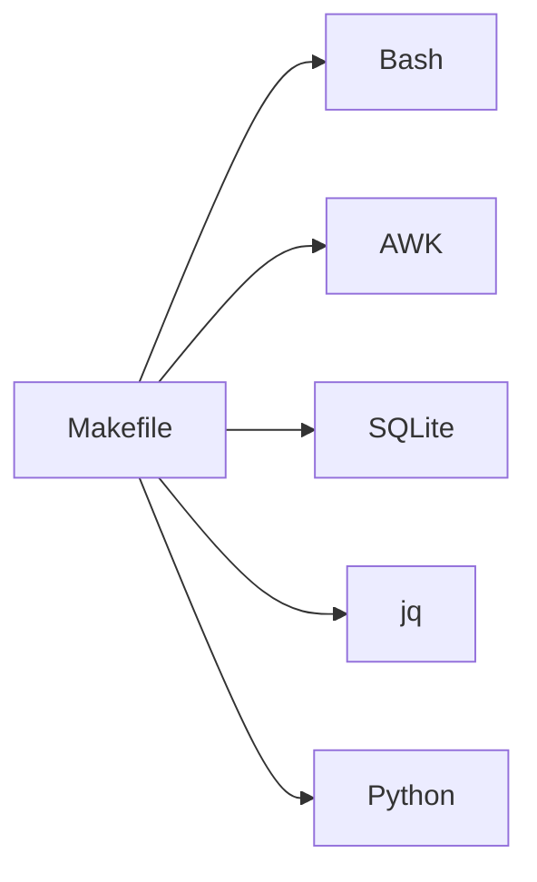
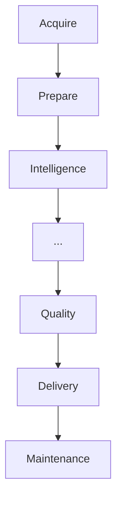
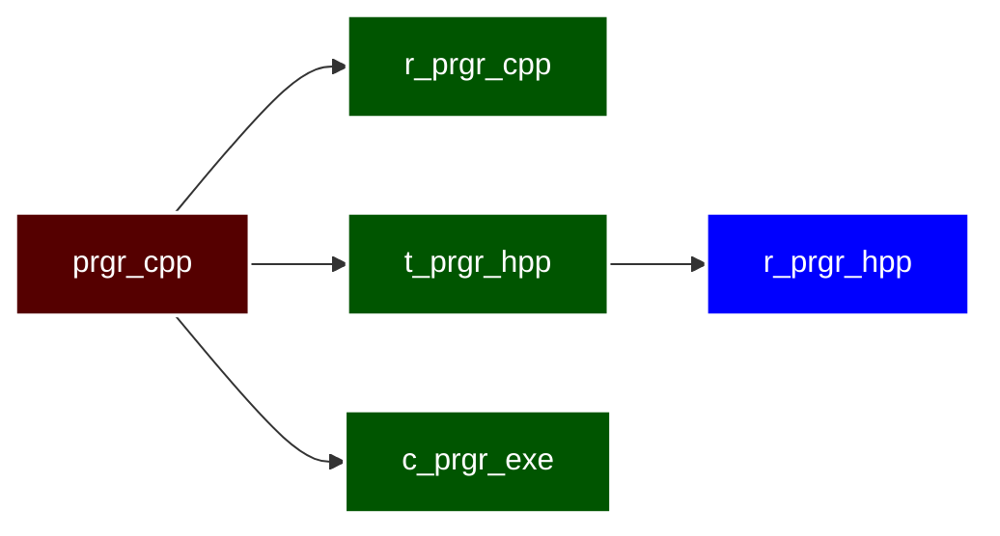

# The Role of a Makefile

GNU Make is a remarkably capable language. It provides variables, functions, conditionals, automatic variables, pattern rules, and macro expansion.

As projects grow, however, application logic often begins to accumulate inside the Makefile until it becomes another programming language that every developer must understand.

We deliberately follow a different philosophy.

> **A Makefile should gather and transform resources, orchestrate their processing, and delegate computation to specialized tools.**

This principle guides every convention presented in this document.

The Makefile describes the workflow of the project. It identifies resources, defines their relationships, establishes execution order, and coordinates the tools responsible for each transformation.

The transformations themselves belong in the tools designed for that job.

Bash excels at orchestration and shell interaction. AWK specializes in text processing. `jq` manipulates JSON efficiently. SQLite manages relational data. Python is well suited for more sophisticated algorithms.

Each tool performs the work it was designed to do.



By separating responsibilities, the Makefile remains easier to read, maintain, and extend. It describes the workflow instead of implementing every processing step.

Throughout this guide, the naming convention becomes a natural consequence of that philosophy. Resource Identifiers, Operation Prefixes, Artifact Suffixes, Canonical Phony Targets, aliases, and pipeline stages form a common engineering language for describing a project's workflow.

---

# From Recipes to Resources

Most Makefiles begin as a small collection of rules.

As projects grow, readability and maintainability become just as important as correctness.

Rather than introducing the naming convention all at once, we'll evolve a simple Makefile step by step. Each stage solves a practical problem without changing the behavior of the build.

Our goal is not to make GNU Make more powerful. It already supports every example we'll see.

Our goal is to make the Makefile communicate its intent more clearly.

Let's begin with the simplest possible solution.

---

# Stage 1 — The Direct Approach

Every Makefile starts somewhere. For a single executable, the simplest solution is to describe the build using the actual filenames involved. The target identifies the executable, the prerequisites identify the required files, and the recipe invokes the compiler.

There is nothing wrong with this approach. For small projects, it's often the best solution because every part of the rule is immediately recognizable. A new reader can understand the build without learning any additional abstractions.

At this stage, simplicity is our greatest asset. Variables and naming conventions should only be introduced after they solve a real problem.

```make
dir_root := ...

VPATH = ...
#===============================================================================
$(dir_root)/bin/calculator.exe : calculator.hpp calculator.cpp
    time gcc -o $(@) ${word 2,$(^)} ${word 1,$(^)}
```

### What did we gain?

* A straightforward and readable rule.
* No unnecessary abstractions.
* A direct correspondence between the Makefile and the files on disk.
* A simple foundation on which we can build.

### What's next?

This rule works well for a single executable, but long dependency lists quickly become difficult to maintain. Can we make those dependencies easier to edit without changing the behavior of the build?

---

# Stage 2 — Improving Maintainability

Our first refinement doesn't change the build. It changes how we maintain it.

GNU Make allows a target's prerequisites to be declared across multiple lines. The dependency graph remains exactly the same, but each dependency becomes an independent statement that is easier to add, remove, reorder, or temporarily disable.

This small change also improves debugging. We can comment out a single dependency, experiment with alternatives, and produce cleaner version-control diffs because each modification affects only one line.

The build behaves exactly as before. We simply make the Makefile easier to work with.

```make
dir_root := ...

VPATH = ...
#===============================================================================
$(dir_root)/bin/calculator.exe : calculator.cpp
$(dir_root)/bin/calculator.exe : calculator.hpp
$(dir_root)/bin/calculator.exe :
    time gcc -o $(@) ${word 1,$(^)} ${word 2,$(^)}
```

### What did we gain?

* Dependencies become easier to maintain.
* Debugging becomes simpler.
* Version-control diffs become cleaner.
* The build remains unchanged.

### What's next?

The dependency list is easier to maintain, but the recipe still assumes each prerequisite appears in a particular position. Can we remove that assumption?

---

# Stage 3 — Eliminating Positional Assumptions

Although our dependency declarations are now easier to maintain, the recipe still depends on the order of the prerequisites.

If we insert or reorder dependencies, we must also verify that the recipe still extracts the correct arguments.

Instead of selecting prerequisites by position, we can select them by what they represent. By filtering the dependency list, the recipe becomes independent of declaration order and expresses its intent more clearly.

Rather than saying, "give me the first prerequisite," we're saying, "give me the C++ source file."

```make
dir_root := ...

VPATH = ...
#===============================================================================
$(dir_root)/bin/calculator.exe : calculator.hpp
$(dir_root)/bin/calculator.exe : calculator.cpp
$(dir_root)/bin/calculator.exe :
    time gcc -o $(@) \
        ${filter %/calculator.cpp,$(^)} \
        ${filter %/calculator.hpp,$(^)}
```

### What did we gain?

* The recipe no longer depends on prerequisite order.
* Dependencies can be reordered safely.
* The rule becomes more robust.
* The recipe describes what it needs instead of where to find it.

### What's next?

We've removed positional assumptions, but the rule is still tied to literal filenames. Can we replace those filenames with identifiers that are easier to reuse?

---

# Stage 4 — Introducing Parameterization

The next refinement removes another source of repetition.

The Makefile still contains the same filenames in multiple places. Renaming a file or adapting the rule for another program requires updating every occurrence.

Instead, we introduce variables that represent those filenames. The rule now refers to identifiers rather than literal values, allowing us to change the filenames in one place.

This is our first real separation between the **structure** of the rule and the **values** it operates on. Once those concerns become independent, adapting the rule for another executable often requires changing only a few variable definitions.

```make
dir_root := ...

VPATH = ...

#===============================================================================
fl_name := calculator
#...............................................................................
$(dir_root)/bin/$(fl_name).exe : $(fl_name).cpp
$(dir_root)/bin/$(fl_name).exe : $(fl_name).hpp
$(dir_root)/bin/$(fl_name).exe :
    time gcc -o $(@) \
        ${filter %/$(fl_name).cpp,$(^)} \
        ${filter %/$(fl_name).hpp,$(^)}
```

### What did we gain?

* Filenames are defined in one place.
* Renaming requires fewer changes.
* The rule becomes easier to reuse.
* The build logic becomes independent of the specific filenames.

### What's next?

Our variables eliminate repeated filenames, but they still represent little more than strings. Can they represent the resources themselves instead?

---

# Stage 5 — From Filenames to Resources

So far, our variables have simply replaced literal filenames. That improves maintainability, but it doesn't fully describe the role those files play within the build.

Instead of thinking about `calculator.cpp` as a filename, we begin thinking about it as the **C++ source resource**. Likewise, `calculator.hpp` becomes the **header resource**, and the executable becomes the **executable resource**.

This is more than a naming change. It changes how we read the Makefile.

The variables no longer represent strings stored on disk. They represent the resources that participate in the build. The rules stop describing relationships between filenames and begin describing relationships between resources.

The Makefile starts communicating the architecture of the build instead of simply listing files.

```make
dir_root := ...

VPATH = ...

#===============================================================================
program_cpp := calculator.cpp
program_hpp := $(program_cpp:cpp=hpp)
program_exe := $(dir_root)/bin/$(program_cpp:cpp=exe)
#...............................................................................
$(program_exe) : $(program_cpp)
$(program_exe) : $(program_hpp)
$(program_exe) :
    time gcc -o $(@) \
        ${filter %/$(program_cpp),$(^)} \
        ${filter %/$(program_hpp),$(^)}
```

### What did we gain?

* Variables now represent resources instead of filenames.
* The role of each identifier becomes immediately clear.
* The Makefile communicates at a higher level of abstraction.
* Future refactoring becomes easier because the concepts remain stable even if filenames change.

### What's next?

We now know **what** each resource is, but we still don't know **how** it was produced. Can our identifiers describe that relationship as well?

---

# Stage 6 — Describing the Resource Lifecycle

Our identifiers now describe the resources involved in the build, but one important question remains.

**How did each resource come into existence?**

Knowing that a variable represents a C++ source file tells us what it is, but not whether it was written by a developer, generated by another tool, copied from another location, or resolved through GNU Make.

To capture that information, we separate the identity of a resource from the operation that produced it.

We do this by introducing **Operation Prefixes**.

The resource keeps its identity, while the prefix records the operation that produced its current representation.

Each identifier now communicates two independent pieces of information:

* **What resource it represents.**
* **How that resource was produced.**

This separation is one of the central ideas of the naming convention. Resource identity remains stable while operations describe how that resource moves through the pipeline.

```make
dir_root := ...

VPATH = ...

#===============================================================================
prgr_cpp := calculator.cpp
r_prgr_cpp = ${filter %/$(prgr_cpp),$(^)}

t_prgr_hpp := $(prgr_cpp:cpp=hpp)
r_prgr_hpp = ${filter %/$(t_prgr_hpp),$(^)}

c_prgr_exe := $(dir_root)/bin/$(prgr_cpp:cpp=exe)
#...............................................................................
$(c_prgr_exe) : $(prgr_cpp)
$(c_prgr_exe) : $(t_prgr_hpp)
$(c_prgr_exe) :
    time gcc -o $(@) $(r_prgr_cpp) $(r_prgr_hpp)
```

### What did we gain?

* Resource identity becomes independent of resource production.
* Identifiers communicate both **what** a resource is and **how** it was produced.
* Rules become more expressive without becoming more complicated.
* The Makefile evolves from a collection of recipes into a description of resource transformations.

### What's next?

We've reached a level of abstraction where the rule is no longer tied to a single executable. Can this pattern become a reusable template for building entire families of similar rules?

---

# Beyond a Single Rule

At this point, we've transformed a simple build rule into a reusable design pattern.

Each refinement solved a practical problem without changing the behavior of the build. We improved maintainability, removed positional assumptions, introduced parameterization, elevated resources to first-class concepts, and separated resource identity from the operations that produce it.

Because the rule now describes resources and transformations instead of specific filenames, it can be generalized into reusable GNU Make macros using features such as `eval`.

Template generation is beyond the scope of this guide, but it becomes a natural next step once these ideas are understood.

The important observation is not that GNU Make supports `eval`.

The important observation is that **our design naturally leads us there**.

---

# Looking Back

None of the six stages made GNU Make more powerful.

GNU Make already supported every example from the beginning.

Instead, each refinement removed a small source of cognitive friction.

We made dependencies easier to maintain.

We removed positional assumptions.

We separated structure from values.

We promoted filenames into resources.

Finally, we separated resource identity from the operations that produce it.

The result is more than a naming convention.

It is a different way of thinking about a Makefile.

Instead of viewing it as a collection of shell commands, we begin to see it as a declarative description of resources, their relationships, and the transformations that connect them.

Once we adopt that perspective, the remainder of this guide becomes a natural extension of those ideas.

---

# The Language of the Pipeline

Every engineering discipline develops its own vocabulary.

As Makefiles grow beyond a handful of compilation rules, they benefit from the same approach.

This guide introduces a small, well-defined vocabulary for describing build systems. Some terms come directly from GNU Make, while others are introduced by this convention.

By establishing that vocabulary first, the naming convention becomes a natural way to express ideas rather than a collection of arbitrary naming rules.

---

# Resources, Operations, and Pipelines

Everything a Makefile does can be understood in terms of three simple concepts.

## Resources

A **Resource** is anything that participates in the build process.

Resources include source files, configuration files, datasets, generated artifacts, executables, reports, archives, dashboards, and any other inputs or outputs managed by the Makefile.

Thinking in terms of Resources instead of filenames raises the level of abstraction.

Filenames may change.

Resources usually do not.

---

## Operations

Resources are transformed throughout the pipeline.

Operations describe those transformations.

Resources describe what exists.

An **Operation** consumes one or more resources and produces one or more new resources.

Compiling source code, parsing CSV files, generating documentation, validating results, packaging artifacts, and publishing reports are all operations.

Resources describe **what** exists.

Operations describe **what happens**.

Keeping those concepts separate makes the Makefile much easier to understand.

---

## Pipelines

Operations rarely stand alone.

The output of one Operation often becomes the input of the next, forming a Pipeline.

A Pipeline describes how Resources move from acquisition to delivery.



Viewed this way, a Makefile becomes a description of a workflow rather than a collection of unrelated recipes.

A reader should be able to understand that workflow without first understanding the implementation details of every command.

---

# Pipeline Stages

Although every project is different, most pipelines follow a similar progression.

To make those responsibilities easier to discuss, we group operations into six conceptual stages.

* **Acquisition** — Obtain resources from external or upstream sources.
* **Preparation** — Convert resources into forms suitable for downstream processing.
* **Intelligence** — Analyze or enrich existing resources.
* **Quality** — Verify correctness, consistency, or integrity.
* **Delivery** — Produce artifacts for users or downstream systems.
* **Maintenance** — Clean, refresh, or maintain the working environment.

These stages are conceptual rather than prescriptive. A project may omit some of them or combine several into a single operation.

Their purpose is simply to provide a common way to describe where an operation belongs within the overall workflow.

---

# Controlled Vocabulary

Once we agree on the concepts, we need a consistent vocabulary to describe them.

Using different words for the same responsibility makes a Makefile harder to read and maintain.

For that reason, this convention adopts a controlled vocabulary of **Canonical Verbs**. Each verb represents one responsibility within the pipeline and should be used consistently throughout the project.

Consistency is more valuable than variety.

Over time, this vocabulary becomes a small domain-specific language that allows both developers and AI assistants to understand the role of a rule simply by reading its name.

These verbs also become the foundation for Canonical Phony Targets, aliases, and Composite Rules introduced later in this guide.

---

# Canonical Verbs

The preferred verbs are grouped according to the pipeline stages.

### Acquisition

* `fetch`
* `ingest`

### Preparation

* `parse`
* `normalize`
* `canonicalize`
* `consolidate`
* `transform`

### Intelligence

* `compute`
* `enrich`
* `classify`
* `synchronize`

### Quality

* `validate`
* `verify`
* `inspect`

### Delivery

* `assemble`
* `generate`
* `render`
* `export`
* `publish`

### Maintenance

* `refresh`
* `clean`
* `purge`

These verbs form the project's preferred vocabulary. New verbs may be added when they represent genuinely new responsibilities rather than synonyms of existing ones.

---

# Canonical Operation Tokens

Each Canonical Verb has a corresponding **Operation Token** used primarily when naming Composite (Orchestration) Rules.

| Verb         | Token | Verb     | Token |
| ------------ | ----- | -------- | ----- |
| fetch        | `fet` | validate | `val` |
| ingest       | `ing` | verify   | `ver` |
| parse        | `par` | inspect  | `ins` |
| normalize    | `nor` | assemble | `asb` |
| canonicalize | `can` | generate | `gen` |
| consolidate  | `con` | render   | `ren` |
| transform    | `tra` | export   | `exp` |
| compute      | `com` | publish  | `pub` |
| enrich       | `enr` | refresh  | `ref` |
| classify     | `cla` | clean    | `cle` |
| synchronize  | `syn` | purge    | `pur` |

These tokens are part of the project's controlled vocabulary. Once assigned, they should remain stable. New tokens may be added as new Canonical Verbs are introduced, provided they follow the same principles of recognition, consistency, and determinism.

---

# Responsibilities Before Implementations

Whenever practical, we name a rule after **what it does**, not **how it does it**.

For example, `normalize_master_ledger` describes a responsibility.

By contrast, `awk_normalize_master_ledger` exposes an implementation detail.

Implementations change.

Responsibilities usually do not.

By naming responsibilities instead of technologies, our Makefile remains stable even as the underlying implementation evolves.

---

# Stable Vocabulary

A controlled vocabulary is valuable only if it remains consistent.

Once a Canonical Verb has been adopted, continue using it instead of introducing synonyms unless they represent genuinely different responsibilities.

Consistency makes the architecture easier to recognize and the Makefile easier to navigate.

---

# Naming Responsibilities

Most Canonical Rules represent a single responsibility.

Occasionally, however, we want a higher-level rule that orchestrates several existing operations.

Names such as `parse_normalize_generate_reports` are perfectly appropriate because they describe a workflow rather than a single action.

Whenever possible, each verb in an orchestration rule should correspond to an existing Canonical Rule.

The orchestration rule then becomes a concise description of the workflow while encouraging reuse of the individual operations.

---

# Resource Identifiers

Resources become useful only when they can be identified consistently.

Resource Identifiers should be compact, recognizable, predictable, and easy to distinguish.

The following sections describe how they are constructed.

---

# General Naming Principles

Every Resource Identifier should follow a few simple principles.

### Recognition over Compression

Prefer the shortest identifier that remains recognizable.

Recognition is required.

Unnecessary length is not.

### Consistency over Creativity

Apply the same naming rules to equivalent Resources.

Prefer predictable names over clever ones.

Consistency improves readability, refactoring, and AI-assisted development.

### Stability

Once a Resource Identifier is established, avoid renaming it without a clear engineering benefit.

Stable identifiers reduce maintenance effort and preserve familiarity across the project.

### Determinism

Whenever practical, two developers following this convention should arrive at the same—or nearly the same—identifier for the same resource.

Reducing subjective naming decisions improves consistency, simplifies refactoring, and makes unfamiliar Makefiles easier to understand.

---

# Identifier Structure

Every Resource Identifier consists of three independent parts.

* **Operation Prefix** — how the resource was produced.
* **Resource Mnemonic** — which resource it represents.
* **Artifact Suffix** — what kind of artifact it is.

Each part communicates one idea and one idea only.

Keeping those responsibilities separate makes Resource Identifiers compact, predictable, and easy to extend.

---

# Identifier Length

Treat identifier length as a design constraint.

Prefer the shortest deterministic identifier that remains recognizable within the project.

Target identifiers of **10 characters or fewer** whenever practical.

Do not expand an identifier simply to make it self-documenting.

Do not encode business, project, company, product, domain, or workflow context that is already implied by the repository, module, directory, or file.

An identifier distinguishes one resource from another. It does not explain the system.

Expand an identifier only when necessary to avoid ambiguity or identifier collisions.

When multiple valid identifiers satisfy these rules, choose the shortest one.

---

# Operation Prefixes

A Resource Identifier tells us which resource we're referring to.

The **Operation Prefix** tells us how that resource entered the pipeline.

Was it constructed?

Was it transformed?

Was it resolved?

Those operations are independent of the resource itself, so we record them separately instead of embedding them into the mnemonic.

Separating resource identity from resource production allows both concepts to evolve independently while preserving their relationship.

## One Operation, One Prefix

Each Operation Prefix represents one well-defined operation.

It describes how the resource was produced, not the value stored by the identifier.

A resource may change its pathname, representation, or contents while retaining the same Operation Prefix if the producing operation has not changed.

Operation Prefixes describe production.

Values describe state.

## Standard Operation Prefixes

| Prefix | Operation |
| ------ | --------- |
| `c_`   | Construct |
| `t_`   | Transform |
| `r_`   | Resolve   |

These three prefixes describe the vast majority of resource relationships found throughout the project.

New prefixes should be introduced only when they represent genuinely new operations.

## Prefix Philosophy

Operation Prefixes describe only how a resource was produced.

They do not describe:

* where the resource is located;
* what the resource contains;
* its current representation;
* the tool that produced it.

Each component of a Resource Identifier has exactly one responsibility.

Keeping those responsibilities separate makes Resource Identifiers compact, predictable, and easy to extend.

## What did we gain?

* Resource identity and resource production become independent.
* Resource relationships become easier to recognize.
* A small vocabulary replaces many special cases.

### What's next?

Now that we know **how** a resource was produced, we need to identify **what kind of artifact** it represents.

---

# Artifact Suffixes

If the Operation Prefix tells us **how** a resource was produced, the **Artifact Suffix** tells us **what** it is.

Fortunately, we don't need a new vocabulary.

Projects already distinguish C++ source files, shell scripts, JSON documents, SQL scripts, executables, and many other artifacts through their familiar file extensions.

This convention simply adopts that existing vocabulary.

## Standard Artifact Suffixes

Whenever practical, the suffix should correspond to the familiar extension of the artifact.

| Artifact       | Suffix |
| -------------- | ------ |
| C++ source     | `_cpp` |
| C++ header     | `_hpp` |
| AWK program    | `_awk` |
| Shell script   | `_sh_` |
| Python program | `_py_` |
| jq program     | `_jq_` |
| JSON document  | `_jsn` |
| CSV document   | `_csv` |
| SQL script     | `_sql` |
| Executable     | `_exe` |

Projects naturally extend this vocabulary as new artifact types appear.

## Suffix Philosophy

Artifact Suffixes describe only the artifact represented by the resource.

They do not describe:

* how the resource was produced;
* its purpose;
* where it is located;
* how it will be used.

Each component of a Resource Identifier has exactly one responsibility.

Keeping those responsibilities separate makes Resource Identifiers compact, predictable, and easy to extend.

---

# Resource Mnemonics

By now, a Resource Identifier answers two questions:

* **How was the resource produced?**
* **What kind of artifact is it?**

The remaining question is:

**Which resource are we talking about?**

That responsibility belongs to the **Resource Mnemonic**.

Keep Resource Mnemonics:

* **10 characters or fewer** whenever practical:
  * `dir_<mnemonic>`
  * `<mnemonic>_<artifact>`
  * `<operation>_<mnemonic>_<artifact>`
* recognizable;
* stable;
* deterministic;
* unique within the project.

If two resources naturally produce the same mnemonic, adjust one of them until both remain easy to distinguish while preserving their recognizability.

Avoid ambiguity without sacrificing consistency.

Where:

* `operation` is typically `c_`, `t_`, or `r_`;
* `mnemonic` generally reflects the file or directory name (for example, `data`, `py`, `sh`, `jsnl`);
* `artifact` generally reflects the artifact type (for example, `_cpp`, `_hpp`, `_sh_`, `_py_`, `_jq_`).

Prefer:

* the shortest identifier that remains recognizable;
* consistency over creativity.

Do not encode business, project, company, product, domain, or workflow context that is already implied by the repository, module, directory, or file.

Assign mnemonics manually using engineering judgment.

Resource Mnemonics identify Resources within the project, not within the business domain.

They are project-local.

They are not intended to be globally descriptive.

---

# Derived Resources

Resources naturally evolve as they move through the pipeline.

Although their representation may change, they continue to describe the same logical resource.

Whenever practical, preserve the original Resource Mnemonic and change only the Operation Prefix or Artifact Suffix.

---

## Preserving Identity

One of the central ideas of this convention is that operations should change only what actually changes.

If the identity of the resource remains the same, its mnemonic should remain the same.

Only the Operation Prefix or the Artifact Suffix should change.

This simple rule makes Resource Families easy to recognize throughout the pipeline.

---

## Example

```make
prgr_cpp := calculator.cpp
r_prgr_cpp = ${filter %/$(prgr_cpp),$(^)}

t_prgr_hpp := $(prgr_cpp:cpp=hpp)
r_prgr_hpp = ${filter %/$(t_prgr_hpp),$(^)}

c_prgr_exe := $(dir_root)/bin/$(prgr_cpp:cpp=exe)
```

Each identifier represents a different resource.

Each serves a different purpose.

Yet they all preserve the mnemonic `prgr`, making their relationship immediately obvious.

The identifiers themselves communicate the evolution of the resource without requiring additional comments or documentation.



---

## Growing the Family

As projects evolve, new Derived Resources naturally appear.

Rather than inventing new naming patterns, we simply extend the existing Resource Identifier by changing only the components that reflect the new operation or artifact.

The identity remains constant.

The representation evolves.

---

# Canonical Phony Targets

So far we've focused on Resources.

Now we focus on the Operations that manipulate them.

If Resource Identifiers answer **"What are we working with?"**, Canonical Phony Targets answer **"What are we doing?"**

Together they make the Makefile read like a description of the project's workflow.

---

## Responsibilities Before Implementations

Whenever practical, we name a rule after **what it does**, not **how it does it**.

For example,

```text
normalize_master_ledger
```

describes a responsibility.

By contrast,

```text
awk_normalize_master_ledger
```

describes an implementation.

Implementations change.

Responsibilities usually do not.

By naming responsibilities instead of technologies, we preserve stable interfaces while allowing the implementation to evolve independently.

---

## Canonical Target Names

Every significant operation should have one Canonical Target Name.

A canonical name should:

* use `snake_case`;
* begin with a Canonical Verb whenever practical;
* describe one responsibility;
* remain stable as the implementation evolves.

Examples:

```text
parse_master_ledger
normalize_trade_history
compute_risk_metrics
generate_dashboard_json
publish_reports
```

The canonical name becomes the public interface of the Makefile.

Documentation, dependency relationships, and conversations between developers should reference these names rather than implementation details or temporary aliases.

---

# Mnemonic Aliases

Canonical Target Names are designed for readability.

Mnemonic Aliases are designed for convenience.

A Mnemonic Alias provides a compact command-line shortcut while preserving a clear relationship to its Canonical Target.

It complements the canonical name—it never replaces it.

---

## Deriving Mnemonic Aliases

The rule is simple.

Take the first letter of each word in the Canonical Target Name.

Examples:

| Canonical Target          | Mnemonic Alias |
| ------------------------- | -------------- |
| `parse_master_ledger`     | `pml`          |
| `normalize_trade_history` | `nth`          |
| `compute_risk_metrics`    | `crm`          |
| `generate_dashboard_json` | `gdj`          |
| `publish_reports`         | `pr`           |

Because the rule is deterministic, developers rarely need to memorize aliases.

Once the canonical name is known, the alias is usually obvious.

---

## Canonical First

Documentation, comments, tutorials, and dependencies should always use the Canonical Target Name.

Mnemonic Aliases exist primarily to improve the interactive command-line experience.

---

# Verb Aliases

Sometimes even a Mnemonic Alias is more than we need.

When we're repeatedly invoking the same operation, using the Canonical Verb alone can be even more convenient.

Examples:

| Canonical Target          | Verb Alias  |
| ------------------------- | ----------- |
| `parse_master_ledger`     | `parse`     |
| `normalize_trade_history` | `normalize` |
| `compute_risk_metrics`    | `compute`   |
| `generate_dashboard_json` | `generate`  |
| `publish_reports`         | `publish`   |

Verb Aliases emphasize the operation rather than the specific resource.

They're especially useful during development, debugging, and exploration.

---

## Three Interfaces, One Responsibility

A rule may expose up to three complementary interfaces.

* **Canonical Target Name** — the stable public interface.
* **Mnemonic Alias** — the deterministic command-line shortcut.
* **Verb Alias** — the optional convenience name.

All three refer to exactly the same responsibility.

---

# Composite (Orchestration) Rules

Most rules perform one responsibility.

Composite Rules coordinate several existing Canonical Targets into a larger workflow.

They don't introduce new processing logic.

They simply orchestrate work that already exists.

Their responsibility is coordination.

---

## Building Workflows

Suppose a reporting workflow consists of:

```text
parse_master_ledger
normalize_trade_history
generate_reports
```

Each rule performs one well-defined responsibility.

A Composite Rule simply defines the order in which those responsibilities execute.

This keeps individual rules focused while making larger workflows easy to invoke.

---

## Naming Composite Rules

Composite Rules are constructed from the operation tokens of the Canonical Verbs they orchestrate.

For example:

```text
par_nor_gen_reports
```

immediately communicates a workflow composed of:

* `parse`
* `normalize`
* `generate`

The name itself describes the sequence of operations.

---

## Composite Rule Aliases

Composite Rules may also define a Mnemonic Alias.

Examples:

| Composite Rule        | Mnemonic Alias |
| --------------------- | -------------- |
| `par_nor_gen_reports` | `pngr`         |
| `fet_par_nor_trades`  | `fpnt`         |
| `ing_prp_cmp_publish` | `ipcp`         |

Although compact, these aliases remain deterministic.

---

## Keep Them Lightweight

Composite Rules coordinate existing Canonical Targets.

They should contain little or no implementation logic.

Whenever practical, delegate processing to Canonical Targets, macros, or specialized tools.

Their responsibility is orchestration, not computation.

---

# Orchestration over Computation

Throughout this guide we've focused on naming Resources and Operations. Those conventions exist for one purpose: helping the Makefile describe the workflow of the project as clearly as possible.

That becomes much easier when the Makefile limits itself to **orchestrating** work instead of **performing** it.

As projects grow, it's tempting to move more logic into GNU Make through increasingly sophisticated macros and conditional expressions. Although this may reduce the number of external scripts, it also makes the Makefile harder to read, understand, and maintain.

We deliberately take the opposite approach.

The Makefile coordinates the pipeline.

Specialized tools perform the work.

---

## Responsibilities

Each layer has a clear responsibility.

The Makefile describes:

* the workflow;
* the dependencies;
* the execution order;
* the resources involved.

Specialized tools such as Bash, AWK, Python, `jq`, SQLite, or others perform the actual computation.

Each component does what it does best.

---

## Transform Resources, Not Logic

Rule bodies should remain focused on orchestration.

Short, deterministic Resource transformations may remain inline when they improve readability.

As transformations grow in size or complexity, move them into a macro or an external tool.

Business logic, algorithms, iteration, and substantial data manipulation belong outside the Makefile.

The Makefile describes the workflow.

Specialized tools implement the computation.

---

## A Declarative Workflow

When orchestration and computation remain separate, the Makefile becomes increasingly declarative.

Readers can understand:

* what Resources exist;
* which Operations are performed;
* how those Resources move through the pipeline;
* what artifacts are produced;

without first understanding the implementation of every processing stage.

That separation allows large Makefiles to remain approachable even as the underlying implementation grows more sophisticated.

---

# A Shared Language

The purpose of this convention is to establish a shared engineering language.

As developers adopt the same Resource Identifiers, Canonical Verbs, Operation Prefixes, Artifact Suffixes, and Canonical Phony Targets, communication becomes shorter, more precise, and more consistent.

Instead of saying,

> "the variable that contains the executable path"

we can simply say,

> "the constructed executable Resource."

Instead of describing

> "the rule that runs the AWK script,"

we refer to

> `normalize_trade_history`.

The names themselves become part of the project's vocabulary.

---

## Reducing Cognitive Load

Every unnecessary naming decision increases cognitive load.

A consistent vocabulary removes that friction by making familiar patterns immediately recognizable, allowing readers to focus on the workflow instead of the identifiers.

---

## Consistency Compounds

The value of this convention grows with the project.

One consistently named Resource is helpful.

Ten begin to reveal patterns.

Hundreds become a language.

Eventually we stop seeing isolated identifiers and begin seeing Resource Families, Operations, and Pipelines.

That's what makes a large Makefile easier to navigate, discuss, and extend.

---

## Let the Convention Evolve

No naming convention is complete from the beginning.

As projects evolve, the vocabulary should evolve with them while preserving the principles that define it.

---

# Final Thoughts

This guide does not attempt to make GNU Make more powerful.

GNU Make already provides the mechanisms.

Instead, it offers a consistent way to think about large Makefiles.

By describing Resources instead of filenames, Operations instead of implementation details, and workflows instead of shell commands, we create Makefiles that communicate their intent clearly.

The naming convention is simply the vocabulary that makes that possible.

As projects grow, that shared vocabulary reduces cognitive load, improves consistency, and allows both developers and tools to understand the build system more quickly.

In the end, the objective is not to enforce a set of naming rules.

The objective is to make the Makefile read like a clear description of the project's workflow.

